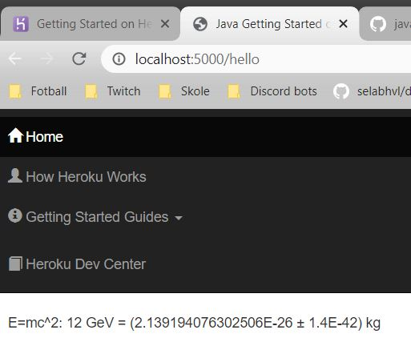

#DAT250-expass1

* *Technical problems that you encountered during installation of the software development environment and how you have solved them*

The installation of IDE, JDK and GIT I had already done some time ago. I encountered issues when I was running through the 
Heroku-tutorial and I came to the point ```Declare app dependencies``` where I was supposed to use the command ```mvn clean install ```.
The problem I had encountered when trying to reach the mvn PATH in the local file system. To solve this problem i added a new custom
PATH-variable to environment-variables which looked like ```C:\Program Files\Maven\apache-maven-3.6.3-bin\apache-maven-3.6.3\bin```. 
After doing this, I still had some issues and this time it was complaining about the java-part. So I did exactly the same as above, and added
the JDK-folder to the PATH-variable, which looked like this: ```C:\Program Files\Java\jdk-14.0.2```

* *How you have validated (checked) that the software development environment is working*

I just followed the Heroku-tutorial, and it had some good examples on how to run the environment. And i followed all the steps 
with everything working as it should. 

Here you can see a screenshot of me running the environment on the localhost, building with Maven. 


* *Technical problems encountered with the Heroku platform and how you solved them*

I did not have any technical problems with Heroku. I think this was a very useful tutorial, and it was almost impossible to 
get into trouble if you just followed the tutorial. 

The only "problem" i encountered was in the ```Provision add-on section```. Here Heroku wants to verify that 
you are legitimate, and therefore wants you to fill inn your billing information on their website. I did'nt feel that the three last
steps of the tutorial was necessary, and therefore did'nt give them my billing information of obvious reasons. 

* *any pending issues with this assignment which you did not manage to solve*

Only "issue" I still haven't solved is the one were I have to verify my billing information on Heroku, in order to complete
the three last steps of the tutorial. Other than that, I don't have any pending "issues". And the issue i mentioned, is not really 
an issue. 

