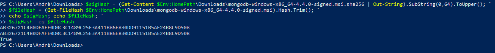

# DAT250-expass3

* *Technical problems that you encountered during installation and use of MongoDB and how you resolved*

I did not encounter big issues while installing MongoDB, I added the bin-directory to path, and everything runs smooth as shown in the screenshot below. 


The only issue I get is when trying to validate the packages. It seems like it can't find the SHA256 of the MongoDB-binaries, shown below:
![]screenshots/sha256false.PNG()

I found out that the sigHash file, was a text-file and not a SHA256-file. So i simply just removed .txt from the filename, and then it worked! 


* *Screenshots for*:
    - The correct validation of the installation package (https://docs.mongodb.com/manual/tutorial/verify-mongodb-packages/)

    


    - Relevant results obtained during Experiment 1 (it is not necessary to put a single screenshot on each substep, but at least one significant from each CRUD operation).

        - **Insert** and finding the inserted item 
        
        

       - **Query** to find more specific things 

       

       - **Update** to update content (updating paper-status in this example) 

       

       - **Delete** all elements with status "A", we see nothing gets outputed when trying to find elements with status "A"

       


    

    - Experiment 2 example working and the additional Map-reduce operation (and its result) developed by each of you.

        - *Perform the map-reduce operation on the orders collection to group by the ```cust_id```, and calculate the sum of the ```price``` for each ```cust_id```:*

        

        - *Perform a map-reduce operation on the orders collection for all documents that have an ord_date value greater than or equal to ```2020-03-01```. The operation groups by the ```item.sku field```, and calculates the number of ```orders``` and the ```total quantity``` ordered for each sku.*

        !()[screenshots/example2.PNG]

### My mapreduce-function 
Using the orders database from earlier example, and I wanna use it to see those who ordered chocolates and see how much money they spent in total the time they bought chocolate.
```javascript
db.orders.insertMany([
   { _id: 1, cust_id: "Ant O. Knee", ord_date: new Date("2020-03-01"), price: 25, items: [ { sku: "oranges", qty: 5, price: 2.5 }, { sku: "apples", qty: 5, price: 2.5 } ], status: "A" },
   { _id: 2, cust_id: "Ant O. Knee", ord_date: new Date("2020-03-08"), price: 70, items: [ { sku: "oranges", qty: 8, price: 2.5 }, { sku: "chocolates", qty: 5, price: 10 } ], status: "A" },
   { _id: 3, cust_id: "Busby Bee", ord_date: new Date("2020-03-08"), price: 50, items: [ { sku: "oranges", qty: 10, price: 2.5 }, { sku: "pears", qty: 10, price: 2.5 } ], status: "A" },
   { _id: 4, cust_id: "Busby Bee", ord_date: new Date("2020-03-18"), price: 25, items: [ { sku: "oranges", qty: 10, price: 2.5 } ], status: "A" },
   { _id: 5, cust_id: "Busby Bee", ord_date: new Date("2020-03-19"), price: 50, items: [ { sku: "chocolates", qty: 5, price: 10 } ], status: "A"},
   { _id: 6, cust_id: "Cam Elot", ord_date: new Date("2020-03-19"), price: 35, items: [ { sku: "carrots", qty: 10, price: 1.0 }, { sku: "apples", qty: 10, price: 2.5 } ], status: "A" },
   { _id: 7, cust_id: "Cam Elot", ord_date: new Date("2020-03-20"), price: 25, items: [ { sku: "oranges", qty: 10, price: 2.5 } ], status: "A" },
   { _id: 8, cust_id: "Don Quis", ord_date: new Date("2020-03-20"), price: 75, items: [ { sku: "chocolates", qty: 5, price: 10 }, { sku: "apples", qty: 10, price: 2.5 } ], status: "A" },
   { _id: 9, cust_id: "Don Quis", ord_date: new Date("2020-03-20"), price: 55, items: [ { sku: "carrots", qty: 5, price: 1.0 }, { sku: "apples", qty: 10, price: 2.5 }, { sku: "oranges", qty: 10, price: 2.5 } ], status: "A" },
   { _id: 10, cust_id: "Don Quis", ord_date: new Date("2020-03-23"), price: 25, items: [ { sku: "oranges", qty: 10, price: 2.5 } ], status: "A" }
])

var mapFunction1 = function() {
   emit(this.cust_id, this.price);
};

var reduceFunction1 = function(keyCustId, valuesPrices) {
   return Array.sum(valuesPrices);
};

db.orders.mapReduce(
    mapFunction1,
    reduceFunction1,
    {
        query: { "items.sku" : "chocolates" },
        out: "chocolates_lovers"
    }
)

db.chocolates_lovers.find()
```

This function gives us the output: 
```
{ "_id" : "Don Quis", "value" : 75 }
{ "_id" : "Ant O. Knee", "value" : 70 }
{ "_id" : "Busby Bee", "value" : 50 }
```
And we can see who bought chocolate, and how much they spent in total when they did. 

* *Reason about why your implemented Map-reduce operation in Experiment 2 is useful and interpret the collection obtained*

Its not usefull, but it gives us a clear view of those customers which use too much money on chocolate, so for health its probably usefull, other than that not so much.. 

* *Any pending issues with this assignment which you did not manage to solve*

Currently the only problem not solved is validating the binaries with SHA256. (**SOLVED**)