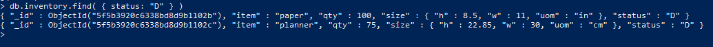

# DAT250-expass3

* *Technical problems that you encountered during installation and use of MongoDB and how you resolved*

I did not encounter big issues while installing MongoDB, I added the bin-directory to path, and everything runs smooth as shown in the screenshot below. 


The only issue I get is when trying to validate the packages. It seems like it can't find the SHA256 of the MongoDB-binaries, shown below:
![]screenshots/sha256false.PNG()


* *Screenshots for*:
    - The correct validation of the installation package (https://docs.mongodb.com/manual/tutorial/verify-mongodb-packages/)

    - Relevant results obtained during Experiment 1 (it is not necessary to put a single screenshot on each substep, but at least one significant from each CRUD operation).

        - **Insert** and finding the inserted item 
        
        

       - **Query** to find more specific things 

       

       - **Update** to update content (updating paper-status in this example) 

       

       - **Delete** all elements with status "A", we see nothing gets outputed when trying to find elements with status "A"

       


    

    - Experiment 2 example working and the additional Map-reduce operation (and its result) developed by each of you.

        - *Perform the map-reduce operation on the orders collection to group by the ```cust_id```, and calculate the sum of the ```price``` for each ```cust_id```:*

        

        - *Perform a map-reduce operation on the orders collection for all documents that have an ord_date value greater than or equal to ```2020-03-01```. The operation groups by the ```item.sku field```, and calculates the number of ```orders``` and the ```total quantity``` ordered for each sku.*

        !()[screenshots/example2.PNG]

