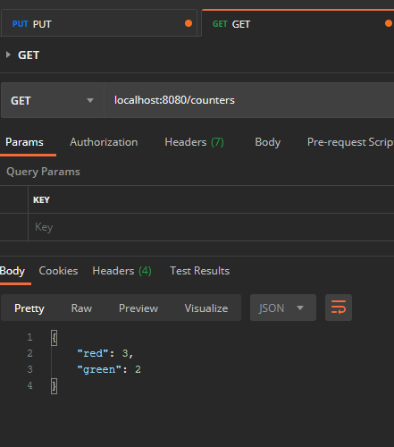
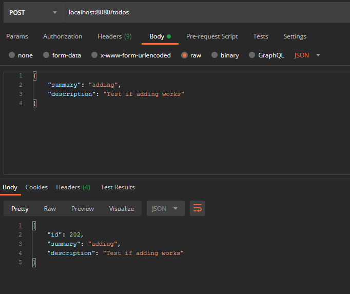
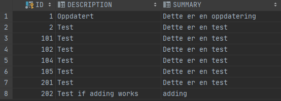
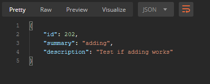
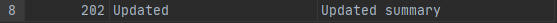
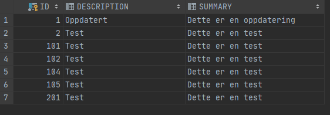

# DAT250 Expass4

## Experiment 1 - Spark/Java Framework project and Postman

Created the following two HTTP requests in Postman:

```HTTP
GET localhost:8080/counters
PUT localhost:8080/counters
```
and in the ***PUT-request*** I added following to the body with JSON: 

```JSON
{
    "red": 3,
    "green": 2
}
```

After running the **PUT-request** we can use the **GET-request** to see if it has been "updated". 



As we see this works as it should! 

## Experiment 2: REST API for TODO-items
So i first off cloned the sparkjava-counters repo. Then I added the Todo-class from exp2. 

To get things to run properly I update the ```persistence.xml```

```xml
<?xml version="1.0" encoding="UTF-8" ?>
<persistence xmlns:xsi="http://www.w3.org/2001/XMLSchema-instance"
             xsi:schemaLocation="http://java.sun.com/xml/ns/persistence http://java.sun.com/xml/ns/persistence/persistence_2_0.xsd"
             version="2.0" xmlns="http://java.sun.com/xml/ns/persistence">
    <persistence-unit name="todos" transaction-type="RESOURCE_LOCAL">
        <class>entities.Todo</class>
        <properties>
            <property name="javax.persistence.jdbc.driver" value="org.apache.derby.jdbc.ClientDriver" />
            <property name="javax.persistence.jdbc.url"
                      value="jdbc:derby://localhost:1527/todosDB;create=true;"/>
            <property name="javax.persistence.jdbc.user" value="test" />
            <property name="javax.persistence.jdbc.password" value="test" />

            <!-- EclipseLink should create the database schema automatically -->
            <property name="eclipselink.ddl-generation" value="create-tables" />
            <property name="eclipselink.ddl-generation.output-mode" value="database" />
        </properties>
    </persistence-unit>
</persistence>
```

As we can see I set up the database, with the network server! And from here it was straight forward just adding the HTTP request to do the CRUD operations with the REST API in the ```App.java``` class.

### POST-request (adding)
```java
// ADD
post("/todos", (req, res) -> {
	Todo add = new Gson().fromJson(req.body(), Todo.class);
	manager.getTransaction().begin();
	manager.persist(add);
	manager.getTransaction().commit();

	return add.toJson();
});
```
Running 
```
POST localhost:8080/todos
```

With JSON-body:

```json
{
    "summary": "adding",
    "description": "Test if adding works"
}
```

Gives us:  


Now we can peek the database to see if it was added: 




### GET-request 
```java
// READ
get("/todos/:id", (req, res) -> {
	manager.getTransaction().begin();
	todo = manager.find(Todo.class, new Long(req.params(":id")));
	manager.getTransaction().commit();
	return todo.toJson();
});
```

Adding it then to a collection in Postman, and trying to get the element we added in the previous segment with ID: 202. So in Postman: 

```
GET localhost:8080/todos/202
```
We then get following in postman:



And we know this the right one. 

### PUT-request (update)

```java
// UPDATE
put("/todos", (req, res) -> {
Todo t = new Gson().fromJson(req.body(), Todo.class);
manager.getTransaction().begin();
manager.merge(t);
manager.getTransaction().commit();
return t.toJson();
});
```
We can now try to update the element with ID: 202.

```
PUT localhost:8080/todos
```

With body:

```json
{
    "id": 202,
    "summary": "Updated summary",
    "description": "Updated"
}
```

We can peek the database: 



and we can see its updated on ID 202. Can also run localhost:8080/todos/2020 to double check, we then get: 

```
{"id":202,"summary":"Updated summary","description":"Updated"}
```

### DELETE 

```java
// DELETE
delete("/todos", (req, res) -> {
Todo del = new Gson().fromJson(req.body(), Todo.class);
del = manager.find(Todo.class, del.getId());
manager.getTransaction().begin();
manager.remove(del);
manager.getTransaction().commit();

return del.toJson();
});
```

WE can now delete the ID: 202, with running:

```
DELETE localhost:8080/todos
```

With body: 

```json
{
    "id": 202
}
```

We know peek the database: 



And we can see it has been deleted. 

## Hand-in: short report
* Technical problems that you encountered during installation and use of Java Persistence Architecture (JPA) and how you resolved

    *   I did'nt have any big errors, while installing the JPA. I imported the project from Github as a maven by using the ```pom.xml``` to avoid problems I encountered in earlier expass'. The only issue I got this time was trying to run postman, I got a error saying it might help to use the desktop agent of postman. After downloading it, and using it I managed to do everything smoothly! 


* A link to your code for experiment 2-4 above

    * Link to code in experiment 2, choose not to do 3 and 4. [Experiment 2 - code](https://github.com/ImGoze/DAT250H20/tree/master/expass4/dat250-sparkjava-counter/counters/counters)

* Any pending issues with this assignment which you did not manage to solve

    * *No pending issues*