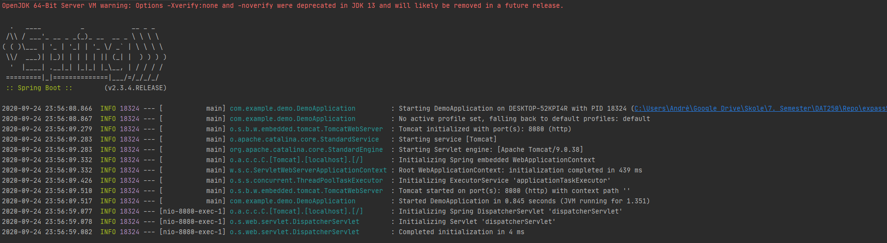

# DAT250 - Expass 5 

### Experiment 1 - Getting started 
I created a *Spring Root Project* which I added the Web dependency in. I generated the .zip folder unzipped it, and run it in IntellIJ. 

I added the following code in ```DemoApplication.java```: 

```java
package com.example.demo;

import org.springframework.boot.SpringApplication;
import org.springframework.boot.autoconfigure.SpringBootApplication;
import org.springframework.web.bind.annotation.GetMapping;
import org.springframework.web.bind.annotation.RequestParam;
import org.springframework.web.bind.annotation.RestController;

@SpringBootApplication
@RestController
public class DemoApplication {


	public static void main(String[] args) {
		SpringApplication.run(DemoApplication.class, args);
	}

	@GetMapping("/hello")
	public String hello(@RequestParam(value = "name", defaultValue = "World") String name) {
		return String.format("Hello %s!", name);
	}
}
```
Running the application:




opening ```http://localhost:8080/hello``` in browser outputs the following shown in the screenshot: 


We can modify the ```name```-variable shown in the return statement, to customize what to be shown when *localhost:8080/hello* gets called. It looks something like this:


### Experiment 2 - Spring Boot
Downloaded the spring-boot demo, and run it in IntellIJ. Then I tried following in the terminal within the ```/complete```-directory. 

```
.\mvnw spring-boot:run
```
Which runs the application and outputs much information (this is just a small bit):


Know we can try the following in the terminal:

```
$ curl localhost:8080
```

And the output: 


### Experiment 3 - REST Service
Downloaded the spring-rest service and run it in IntellIJ. Doing the following GET-request to localhost:

```
localhost:8080/greeting
```

Gives us the following JSON-representation: 


We can also create a name-query by visiting:

```
http://localhost:8080/greeting?name=User
```

Which outputs:

```json
{"id":3,"content":"Hello, User!"}
```

As we can see, the ID has increased, its now **3** because I've visited the site 3-times. If we use the Name-query it will continue to increase. 

### Experiment 4 - Data Access
Dowloaded the gs-accessing-data-jpa.zip, unzip and then I run the application. Running the application gives: 

```
== Customers found with findAll():
-------------------------------
Customer[id=1, firstName='Jack', lastName='Bauer']
Customer[id=2, firstName='Chloe', lastName='O'Brian']
Customer[id=3, firstName='Kim', lastName='Bauer']
Customer[id=4, firstName='David', lastName='Palmer']
Customer[id=5, firstName='Michelle', lastName='Dessler']

== Customer found with findById(1L):
-------------------------------
Customer[id=1, firstName='Jack', lastName='Bauer']

== Customer found with findByLastName('Bauer'):
-------------------------------
Customer[id=1, firstName='Jack', lastName='Bauer']
Customer[id=3, firstName='Kim', lastName='Bauer']
```

We here see the customers. 

### Hand-in: Short Report
* *Technical problems that you encountered during the completion of the tutorial*
	* Did'nt have any big issues with the tutorial. Main-issue I had was trying to run the *"Create an application class"* example, where we should use a logger to get the output. Did'nt fully understand what to do here. The other only thing I struggled with was trying to build the project as a JAR then trying to run it. 

* *A link to your code for experiment 1-4 above* 
	* [Experiment 1]()
	* [Experiment 2]()
	* [Experiment 3]()
	* [Experiment 4]()

* Any pending issues with this assignment which you did not manage to solve
	* Both issues I mentioned earlier i've yet not solved


