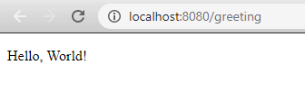
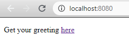

#  DAT250 - Expass 6 

### Experiment 1 - Modell-View-Controller Web Applications

Downloaded the code in the tutorial, imported it as Maven project. Then I ran the application, then i went to 

```localhost:8080/greeting``` 

Which outputs the following:



Then i added a homepage by creating ```index.html``` which contains:

```html
<!DOCTYPE HTML>
<html>
<head>
    <title>Getting Started: Serving Web Content</title>
    <meta http-equiv="Content-Type" content="text/html; charset=UTF-8" />
</head>
<body>
<p>Get your greeting <a href="/greeting">here</a></p>
</body>
</html>
```

Which gives this extra page: 



and when you click ```here``` you come to the ```localhost:8080/greeting``` page.

### Experiment 2 - Single-page Web Applications

Followed the tutorial from [React tutorial](https://reactjs.org/tutorial/tutorial.html). I chose to use Node.js with Visual Studio Code. Completing the tutorial gave me a nice-functioning tic-tac-toe game. Running the program with 

```npm start```

To open a new browser with the tic-tac-toe. Program can also be run by typing 

```code .``` 

from the project folder.

This gif shows a iteration of the game in browser: 


### Hand-in: Short report
- *Technical problems that you encountered during the completion of the tutorial*
    - Did not encounter any issues of with completing the tutorials. 

- *A link to your code for experiments 1-2 above*
    - [Experiment 1 - Modell-View-Controller Web Applications](https://github.com/ImGoze/DAT250H20/tree/master/expass6/gs-serving-web-content-master)

    - [Experiment 2 - Single-page Web Applications](https://github.com/ImGoze/DAT250H20/tree/master/expass6/my-app)

- *Any pending issues with this assignment which you did not manage to solve*
    - Don't have any pending issues. Good tutorials! 
