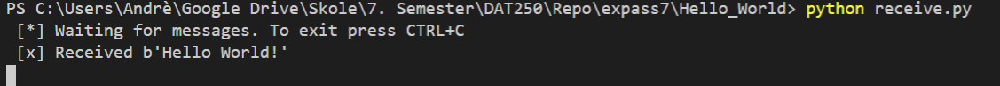
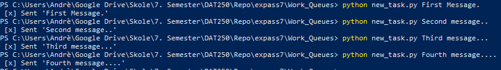
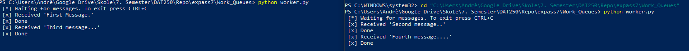
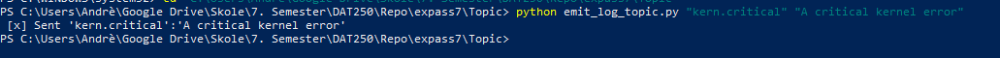
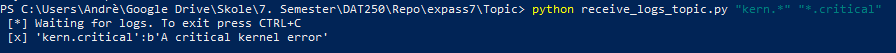

# DAT250 - Expass 7

### Experiment 1 - Installation
Installed successfully using ```chocolatey```.

### Experiment 2 - Hello World! 
Tutorial: [Hello World!](https://www.rabbitmq.com/tutorials/tutorial-one-python.html)

Chose to do this in **Python**. Needed to install the ```pika``` module, did this by using ```pip3 install pika```. Created two files ```send.py``` and ```receive.py```. Running first ```receive.py``` starts the queue and it waits to get sent a message, when then running ```send.py``` the following happens, ```receive.py``` outputs: ¨



And we can see it received a "Hello World!"

### Experiment 3 - Queue messaging
Tutorial: [Work queues](https://www.rabbitmq.com/tutorials/tutorial-two-python.html)

Creating two new scripts ```new_task.py``` and ```worker.py```. Using ***3*** terminals, running ```worker.py``` in two of them, and ```new_task.py``` in the last one. Using ```new_task.py``` to send some messages, and I receive different messages in the two different *worker-terminals* as shown below:

Running ```new_task.py``` a few times: 



This is how we receive it in the two different ```worker.py``` terminals:



### Experiment 4 - Topics
Tutorial: [Topics](https://www.rabbitmq.com/tutorials/tutorial-five-python.html)

Creating two files ```emit_log_topic.py``` and ```receive_logs_topic.py```.

Running ```receive_logs_topic.py``` and ```emit_log_topic.py```, and sending in a error from ```emit_log_topic.py```:



And we can see we sent a error 
>[x] Sent 'kern.critical':'A critical kernel error'

then switching over to the ```receive_logs_topic.py``` terminal we can see the sent error: 



And we can see we have waited and received the sent error:
>[*] Waiting for logs. To exit press CTRL+C\
>[x] 'kern.critical':b'A critical kernel error'

### Hand in: Short report 

* *Technical problems that you encountered during the completion of the tutorial*
    * Only issue that occured was really when trying to use the ```pika```-module. But it happened because I was telling the file to use a given path (as they did in the turoial). Removing this fixed my problem because it was conflicting with multiple versions of Python downloaded on my computer. Below you can see what I removed:
    
    ```python
    #!/usr/bin/env python
    ```
    
* *A link to your code for experiments 1-4 above*

    * Experiment 1 - *No code for this one, just installation*
    * Experiment 2 - [Hello World!](https://github.com/ImGoze/DAT250H20/tree/master/expass7/Hello_World)
    * Experiment 3 - [Work queues](https://github.com/ImGoze/DAT250H20/tree/master/expass7/Work_Queues)
    * Experiment 4 - [Topics](https://github.com/ImGoze/DAT250H20/tree/master/expass7/Topic)

* *Any pending issues with this assignment which you did not manage to solve*
    * *No pending issues*